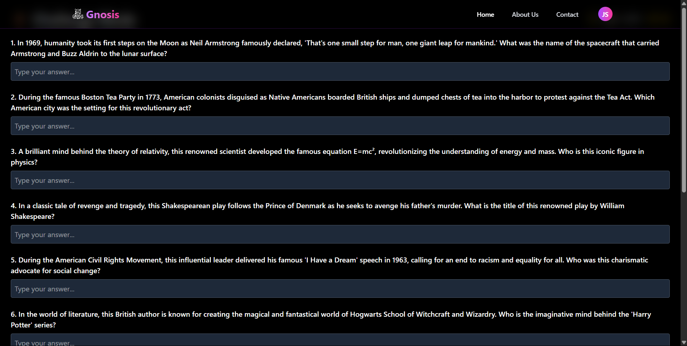

# Gnosis: AI-Powered Quizzing Platform

Gnosis is an intelligent, full-stack quizzing platform built for our university’s quizzing club. It enables users to practice topic-wise quizzes, take AI-generated challenge mode tests, and track their performance through an XP-based gamification system. It is designed for scalability, interactivity, and a seamless quiz experience.

---

## 🚀 Features

### 🧠 Practice Mode
- Topic-based filtering of quiz sets from past competitions
- Clean UI for selecting, answering, and reviewing quizzes

### ⚔️ Challenge Mode (Powered by OpenAI)
- Prompts OpenAI’s GPT API to generate 10-question timed quizzes
- Countdown timer (25 mins) for a test-like experience
- Intelligent answer evaluation using:
  - Keyword matching
  - Fuzzy string similarity (Dice’s Coefficient via string similarity libraries)
- Detailed performance report with strengths and areas to improve

### 🧾 XP & Credit System
- Users earn XP for activities like logging in and completing challenges
- Challenge Mode access is gated by a credit system:
  - 7 free credits on signup
  - Recharge via Stripe: ₹10 → 2 credits, ₹99 → 25, ₹199 → 65
  - 1 credit deducted per challenge attempt

### 🛠️ Admin Tools
- Admin dashboard to upload upcoming events and quizzes
- CRUD operations on event data
- Makes the platform a one-stop portal for the club

### 📊 User Analytics
- Integrated `timeme.js` to track active time spent on quizzes
- Helps measure real engagement and quiz-taking behavior

---

## 💻 Tech Stack

### 🧩 Frontend
- React.js
- Tailwind CSS
- Axios
- React Router

### ⚙️ Backend
- Express.js
- Node.js
- PostgreSQL
- OpenAI API
- Stripe API (for subscription payments)

### 📁 Developer Tools
- VS Code, Postman, Git

---

